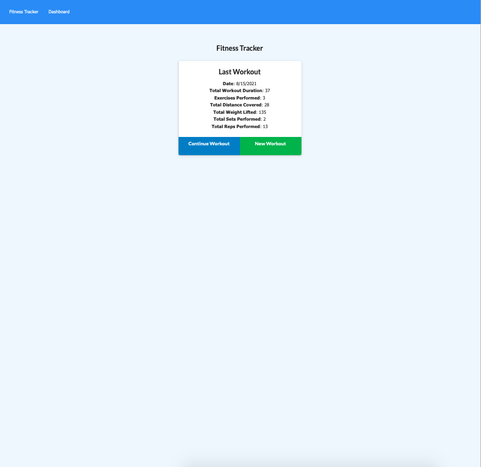

# hw-18

Fitness Tracker:
Track your exercises with the fitness tracker! On the home screen you will be greeted with some stats about your last workout, as well as buttons to create a new workout or add an exercise to the last one. Each workout can have multiple exercises. Your stats page allows you to track the duration of workout over your last few workouts as well as the different amounts you have lifted. 

Created by David Ludwik

The program runs on an express server and uses the mongoose library to interface with the mongodb database. Mongoose allows for the creation of schemas to make adding workouts and exercises within workouts more structured. The charts are created via the chart.js library.
